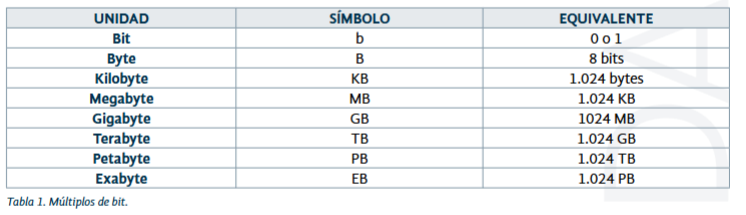
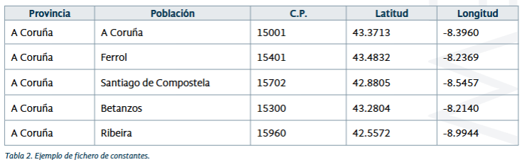
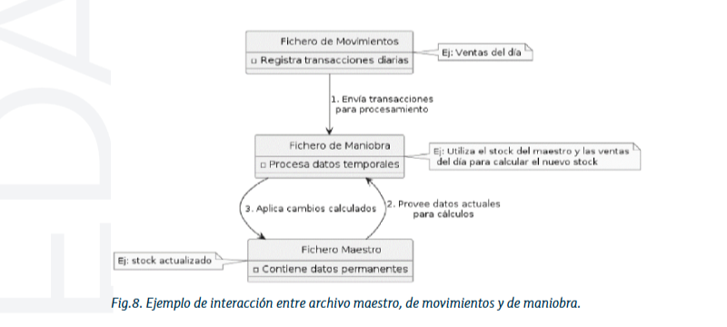
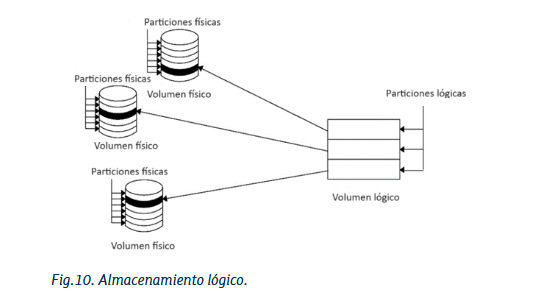
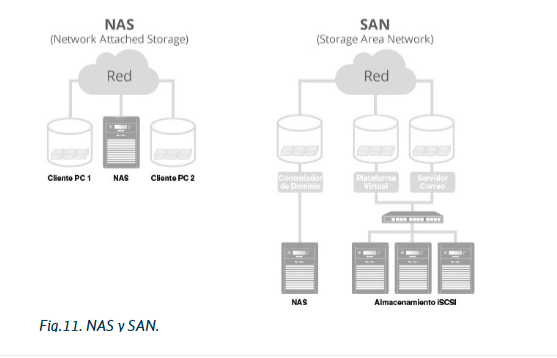
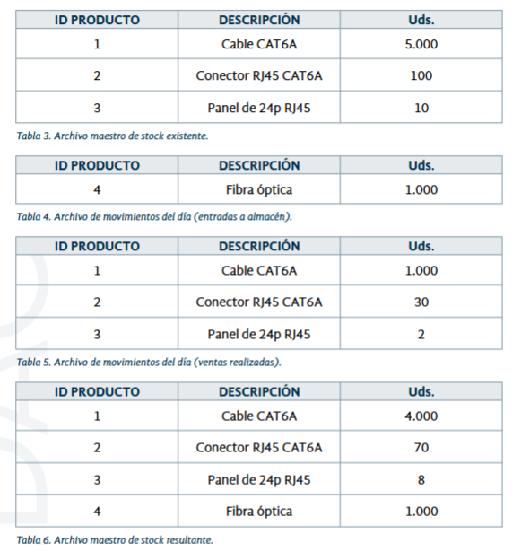
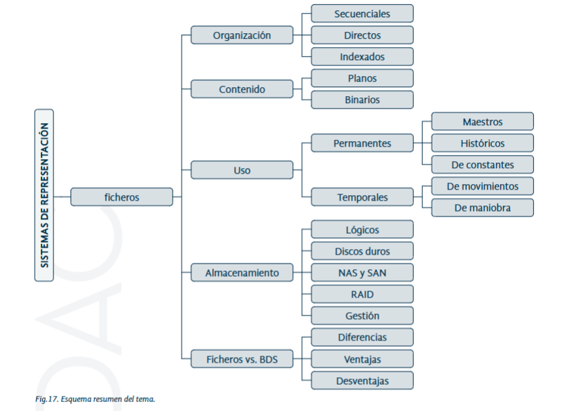

# Tema 1: Sistemas de Representación de la Información. Ficheros

## 1. Introducción
La información (datos) es el recurso más valioso en la era digital actual. Su correcta gestión y almacenamiento son clave para cualquier organización. Este tema introduce los conceptos fundamentales de los sistemas de información y bases de datos.

## 2. Representación de la Información
- Todo dato en un sistema debe traducirse a binario (bits 0 y 1).
- El bit es la unidad mínima de información.
- Los datos se agrupan en bytes, kilobytes, etc.
- Archivos binarios (.jpg, .mp4, .exe) requieren formatos específicos para ser interpretados.

## 3. Concepto de Fichero
- Un fichero es una colección de datos almacenada electrónicamente.
- Tiene nombre y extensión (.txt, .jpg, .exe).
- Compuesto por registros lógicos formados por atributos.

## 4. Tipos de Ficheros según su Organización
- **Secuenciales**: lectura secuencial, requieren leer desde el inicio.
- **Acceso Directo**: acceso rápido por posición, desperdician espacio.
- **Indexados**: organizados por índices para mejorar el acceso.

## 5. Tipos de Ficheros según su Contenido
- **Ficheros Planos (Texto)**: interpretables directamente (.HTML, .PHP, .XML, .JAVA, .SQL).
- **Ficheros Binarios**: requieren software específico (.DOCX, .EXE, .JPG).

## 6. Tipos de Ficheros según su Uso
- **Permanentes**:
  - Maestros: estado actual.
  - Históricos: registro de información pasada.
  - Constantes: guardan datos que apenas cambian con el paso del tiempo.

  

- **Temporales**:
  - Movimientos: almacenan información de actividades y transacciones recientes o en curso.
  - De trabajo o maniobra: procesamiento temporal.

  

## 7. Sistemas de Almacenamiento de la Información
- Incluyen discos duros, SSD, memorias flash, NAS, y almacenamiento en la nube.
- Desde la perspectiva de las bases de datos, el sistema de almacenamiento lógico agrupa recursos físicos como una sola unidad.

## 8. Tipos de Sistemas de Almacenamiento
- **Discos Duros**: magnéticos o SSD, gran capacidad.
- **NAS**: actúa como un dispositivo de almacenamiento centralizado único (como un disco duro conectado a una red LAN)
- **SAN**: es una red de almacenamiento dedicada que posibilita el intercambio de datos mediante el uso de software especializado

- **RAID**: múltiples discos que operan como uno para redundancia y rendimiento.

- **Gestión de los sistemas de almacenamiento**: centrada en capacidad, fiabilidad, rendimiento y recuperación.

## 9. Comparación entre Ficheros y Bases de Datos
| Característica    | Ficheros                              | Bases de Datos                      |
|-------------------|----------------------------------------|-------------------------------------|
| Organización      | Carpeta sin estructura relacional      | Tablas con relaciones               |
| Accesibilidad     | Limitada por el sistema operativo      | Eficiente mediante DBMS             |
| Manipulación      | Básica, requiere programación          | Avanzada con SQL                    |
| Seguridad         | Básica del sistema operativo           | Robusta con control de acceso       |
| Escalabilidad     | Ineficiente con grandes volúmenes      | Escalable y robusta                 |

## 10. Caso Práctico 1: Gestión de tienda y almacén
**Planteamiento**: Un amigo nuestro de la infancia ha abierto una tienda de productos de informática con la que
está muy ilusionado. Se le da muy bien la parte comercial, pero no tiene mucho conocimiento sobre aplicaciones
informáticas. Sabe que somos unos grandes profesionales en este campo, por lo que nos ha pedido ayuda para la
gestión de su negocio, con el fin de controlar el stock del que dispone en su almacén.

**Nudo**: Una solución rápida (mientras construimos una base de datos potente y robusta) será construir un fichero
maestro que contenga todo el stock del almacén. Además, generaremos dos ficheros más de movimientos: uno para
el personal de tienda (que contendrá las ventas del día) y otro para el de almacén (que contendrá las entradas de
nuevo material). Cada tipo de producto tendrá un ID distinto para poder distinguirlo del resto.

**Desenlace**: Una posible propuesta de diseño es la siguiente, en la que se ha generado un fichero de stock existente
en el almacén. Al final del día, se ha obtenido el fichero de movimientos con las ventas realizadas y el de almacén con
las nuevas entradas. Como resultado, se obtiene el fichero maestro de stock modificado.

## 11. Caso Práctico 2: Gestión de tienda y almacén
**Planteamiento**: Un amigo, dueño de una pequeña tienda de informática, necesita ayuda para gestionar el stock de su almacén, ya que actualmente usa un disco duro externo (que además emplea para guardar películas), lo cual no es fiable ni seguro.

**Nudo**:Se le ha apoyado inicialmente con archivos simples para gestionar sus existencias (productos, entradas y ventas), pero está claro que necesita una solución más segura y profesional, aunque sin gran inversión ni infraestructura compleja, dado que:

- El negocio es pequeño.

- No tiene intención de crecer a corto plazo.

- Le preocupan principalmente la seguridad y la disponibilidad de la información (evitar pérdidas de datos).

**Desenlace**: Dadas las características del establecimiento, y basándonos en lo que hemos visto a lo largo del tema, no parece que la opción del disco duro en un PC sea óptima, aunque podría ser viable siempre y cuando se aplique redundancia.
Tampoco parece que implementar una SAN sea lo mejor, dado que estos sistemas son caros y complejos.
Por tanto, para este entorno quizá la mejor opción sería un sistema NAS que aplique RAID, de manera que se asegure
la redundancia del sistema.

[Calculadora RAID] (https://www.synology.com/es-es/support/RAID_calculator)

## 12. Resumen

